---
lab:
    title: '实验室 2 – 部署 Azure SQL 数据库'
    module: '计划和实现数据平台资源'
---

# 实验室 2 – 部署 Azure SQL 数据库

**预计完成时间:** 35-40 分钟

**先决条件:** 无

**实验室文件:** 无

# 实验室概述

学生将配置部署具有虚拟网络终结点的 Azure SQL 数据库所需的基本资源。将使用实验室 VM 中的 Azure Data Studio 验证到 SQL 数据库的连接。最后，将创建一个 Azure Database for PostgreSQL。

# 实验室目标

学生将学习以下内容：

1. 配置基本资源

2. 部署 Azure SQL 数据库 

3. 使用 Azure Data Studio 连接到 Azure SQL 数据库

4. 部署 Azure Database for PostgreSQL

# 应用场景

作为 AdventureWorks 的数据库管理员，你将建立一个新的 SQL 数据库，其中包括一个虚拟网络终结点，以增加和简化部署的安全性。将使用 Azure Data Studio 评估 SQL Notebook 在数据查询和结果保留方面的使用。

最后，将部署 Azure Database for PostgreSQL 以支持其他数据系统需求。

# 练习 1: 配置基本资源

## 任务 1: 创建资源组

1. 启动浏览器，然后打开 Azure 门户 [http://portal.azure.com](http://portal.azure.com/)，使用适当的凭据登录

2. 在“主页”屏幕中，单击 **“资源组”** 按钮。  
‎
	

3. 查看你现有的资源组，然后单击 **“添加”** 按钮，创建一个新的资源组。  
‎
	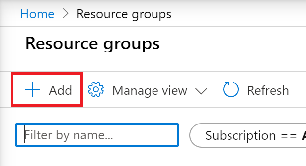

4. 使用所需的信息完成“创建资源组”向导，以创建 RG。

	- 确保将订阅设置为所需的订阅

	- 输入 “**DP-300-Lab02**” 作为资源组的名称

	- 在本实验室中，请选择离你的实际位置最近的地区

	- 单击 **“查看 + 创建”** 按钮*  
‎
	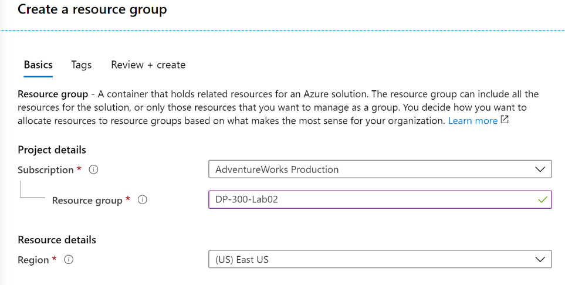

	- 单击 **“创建”** 按钮

## 任务 2: 创建虚拟网络

1. 在左侧导航窗格中，单击 **“虚拟网络”**。  
‎
	实验室

2. 使用以下信息完成“基本”页面：

	- 订阅: **选择实验室订阅**

	- 资源组: 选择 **DP-300-Lab02** 资源组

	- 名称: **Lab02-vnet**

	- 区域：选择创建资源组时的相同区域（离你的位置最近的区域）  
‎
	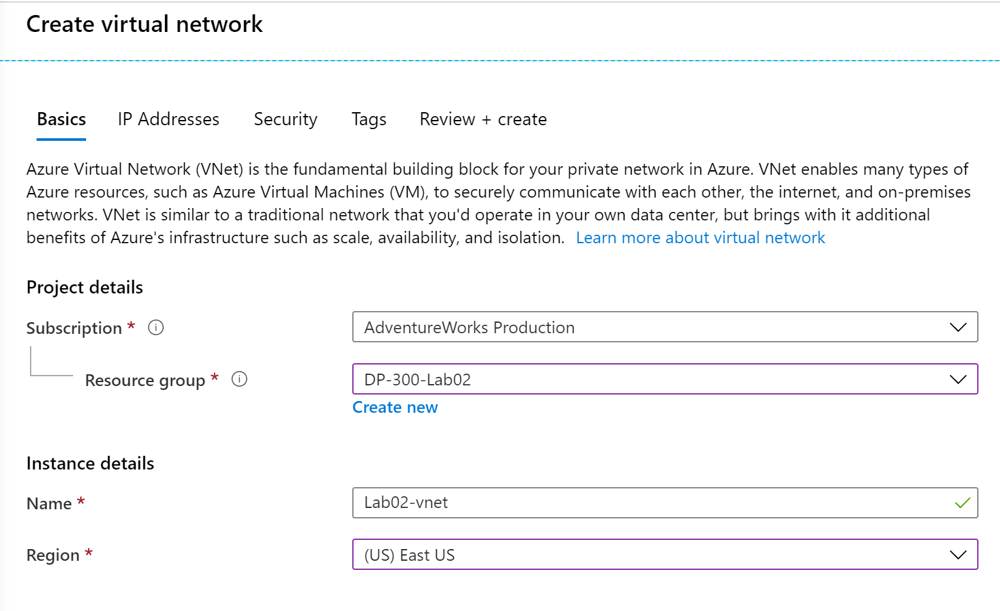

	- 单击 **“下一页: “IP 地址”** 按钮  
‎
	

3. 为 Azure SQL 数据库终结点配置虚拟网络的 IP 范围和准备

	- 在“IP 地址”页面上，保留 IPv4 地址空间的默认值。

	- 单击 **“默认”** 子网  
‎
	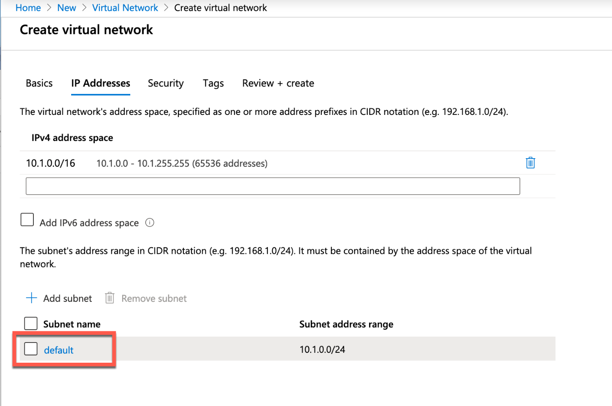

	- 在右侧的“编辑子网”浮出控件中，展开“服务”下拉菜单，然后勾选 **Microsoft.Sql**  
‎
	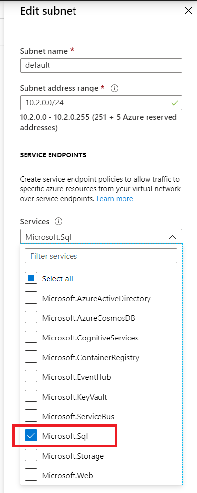

	- 单击 **“保存”**

	- 单击 **“查看 + 创建”** 按钮，查看新虚拟网络的设置，然后单击 **“创建”**

# 练习 2： 部署 Azure SQL 数据库

## 任务 1： 部署 Azure SQL 数据库

1. 在 Azure 门户中，单击左侧导航栏顶部的 **“+ 创建资源”**  
‎
	

2. 在顶部的搜索框中搜索“ SQL 数据库”，然后从选项列表中单击 **“SQL 数据库”**  

	

3. 单击 **“创建”** 按钮

4. 使用以下输入完成“创建 SQL 数据库基础知识”屏幕，然后单击 **“下一页: 网络”**

	- 订阅：选择实验室订阅

	- 资源组: **DP-300-Lab02** （练习 1 中创建的 RG）

	- 数据库名称: **AdventureWorksLT**
	
	- 服务器：单击 **“新建”**。 在“新建服务器”边栏中，完成以下表单：

		- 服务器名称: **dp300-lab-&lt;your initials (lower case)&gt;** （服务器名称必须是全局唯一）

		- 服务器管理员登录名: **dp300admin**

		- 密码: **dp300P@ssword!**

		- 确认密码: **dp300P@ssword!**

		- 位置：选择离你最近的区域（与练习 1 相同）

		- 你的新服务器侧栏应如下图所示。单击 **“确定”**

		


    -  想要使用弹性池: **否**

    -  计算 + 存储: 单击 **“配置数据库”**

		- 在“配置”屏幕上，单击 **“寻找基本、标准、高级？”**

		

		- 单击 **“基本”**

		- 单击 **“应用”** 按钮


**注意: 记下该服务器名称和你的登录信息。你将在后续实验室中使用此信息。**

5. 查看设置，然后单击“下一页: **网络**  
‎
	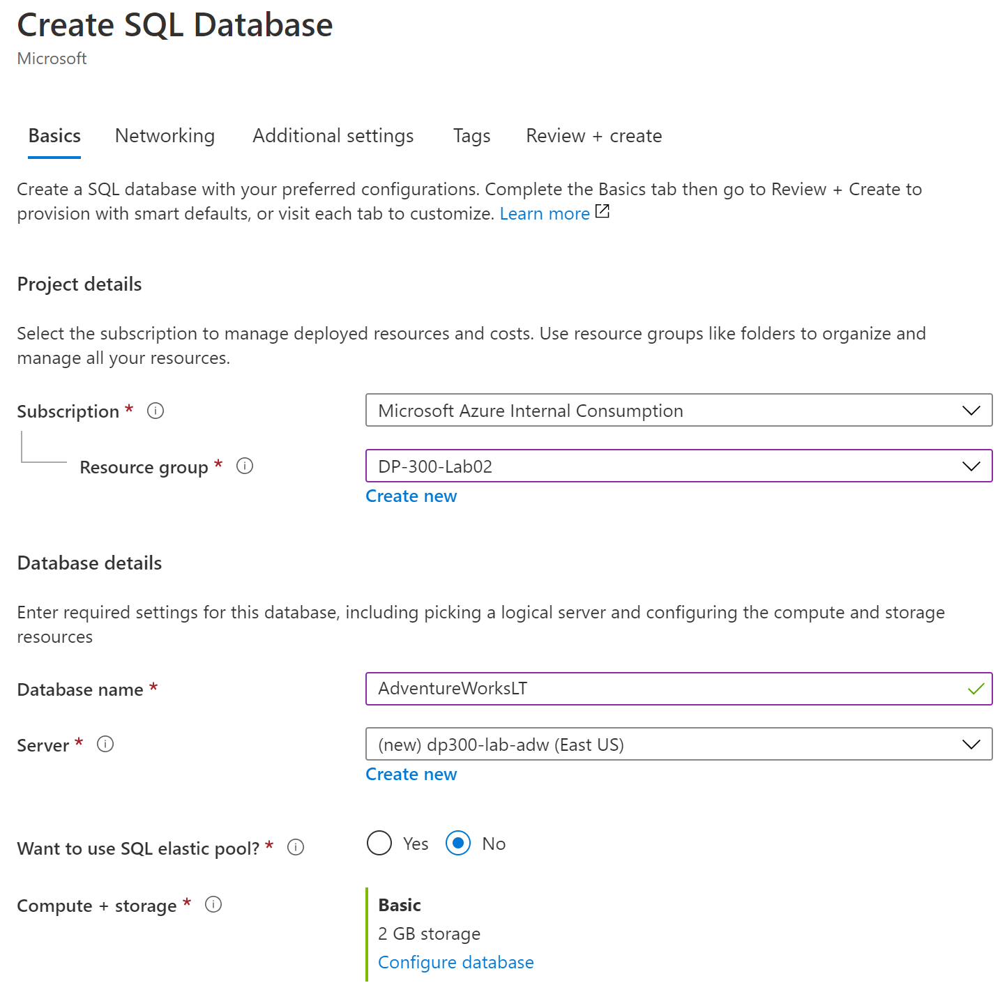

6. 在“网络”屏幕上，对于“连接方法”，单击 **“专用终结点”** 单选按钮  
‎
	

7. 然后单击“专用终结点”下的 **“添加专用终结点”** 链接  
‎
	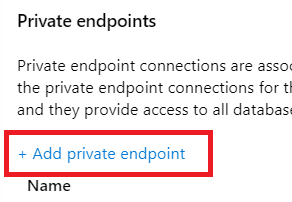

8. 完成“创建专用终结点”浮出控件，如下所示：

	- 订阅: 确保选择实验室订阅

	- 资源组: **DP-300-Lab02**

	- 位置: 在本实验室的先前部分选择的同一区域

	- 名称: **DP-300-SQL-终结点**

	- 目标子资源: **SqlServer**

	- 虚拟网络: **Lab02-vnet**

	- 子网: **默认值 (10.x.0.0/24)**

	- 专用 DNS 集成选项可以保留默认设置

	- 单击 **“确定”** 之前检查设置  
‎
	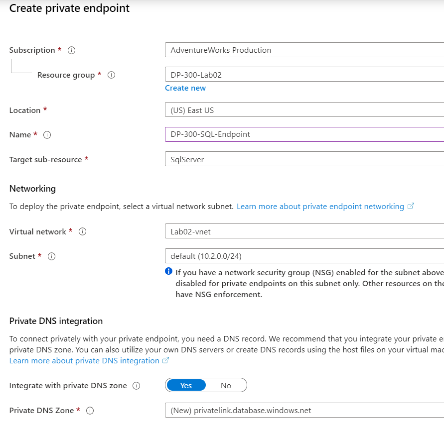

9. 确认终结点显示在“网络”页面上，然后单击 **“下一页: “其他设置”** 按钮。  
‎
	

10. 在“其他设置”页面上，配置以下选项：

	- 将“使用现有数据”设置为 **“示例”**

	- 确保“启用高级数据安全性”设置为 **“以后再说”**  
‎
	

11. 单击 **“查看 + 创建”**。

12. 查看设置，然后单击 **“创建”**。

13. 部署完成后，单击 **“转到资源”** 按钮  
‎

## 任务 2: 启用对新 SQL Server 的所有 Azure 服务访问

1. 在“SQL 数据库”边栏选项卡中，单击顶部的 SQL Server 名称链接  
‎

	

2. 在 SQL Server 对象的导航边栏选项卡上，单击“安全性”下面的 **“防火墙和虚拟网络”**

	

3. 将“允许 Azure 服务和资源访问此服务器”设置为 **“是”**  


	

4. 单击 **“保存”**

 

# 练习 3: 连接至 Azure SQL 数据库

## 任务 1: 在 Azure Data Studio 中注册 Azure SQL DB 实例

1. 从实验室 VM 启动 Azure Data Studio (ADS)

	- 你可能会在 Azure Data Studio 的首次启动时看到此弹出窗口。如果看到它，请单击 **“是”**  


2. 当 Azure Data Studio 打开时，单击左侧菜单上的扩展按钮，如下所示。

 
	

 

3. 在扩展搜索框中，键入“Postgres”。将显示 Microsoft PostgreSQL 扩展。单击“安装”按钮，如下突出显示。

	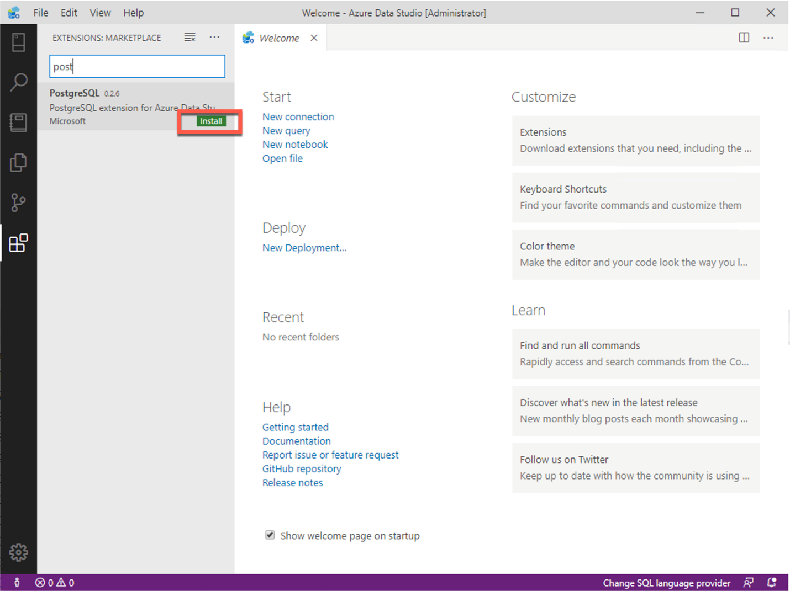

 

4. 单击 ADS 左侧边栏中的 **“连接”** 按钮，然后单击 **“添加连接”** 按钮
	
	

5. 在“连接”侧边栏中，在“连接详细信息”部分填写连接信息，以连接到上一个练习中创建的 SQL 数据库。

	- 连接类型: **Microsoft SQL Server**

	- 服务器：输入在练习 2，任务 1 中创建的 SQL Server 的名称。例如: **dp300-lab-xx.database.windows.net**  
	[请注意，系统要求你使用首字母缩写创建服务器名称，而不是“xx”]

	- 身份验证类型: **SQL 登录**

	- 用户名: **dp300admin**

	- 密码: **dp300P@ssword!**

	- 展开数据库下拉列表以选择 **AdventureWorksLT**。如果要求你添加防火墙规则以将客户端 IP 添加到该服务器，请单击“添加帐户”并登录到你的 Azure 帐户。在“创建新防火墙”屏幕中单击 **“确定”**。
		
		
	
	- 服务器组将保持 **&lt;default&gt;** 状态

	- 如果需要，可以使用数据库的易记名称填充名称（可选）

	- 查看设置，然后单击 **“连接”**  
	‎

	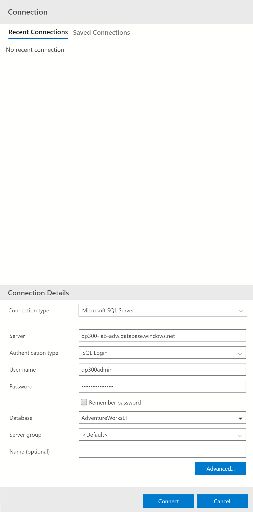

6. ADS 将连接到数据库，并显示有关 DB 的一些基本信息，以及部分对象列表  
‎
	

## 任务 2：使用 SQL Notebook 查询 Azure SQL 数据库

1. 在连接到该实验室的 AdventureWorksLT 数据库的 Azure Data Studio 中，单击 **“新建笔记本”** 按钮  
‎
	

2. 单击 **“+文本”** 按钮，在笔记本中添加新的文本框  
‎	
	


**注意：** 在笔记本中，你可以嵌入纯文本以解释查询或结果集。


3. 输入文本 **“按订单小计的前十大客户”**，根据需要将其设为粗体  
‎
	

4. 单击 **“+ 代码”** 按钮，在笔记本末尾添加新单元格以在其中添加查询  
‎
	

5. 将以下 SQL 语句粘贴到新单元格中

```sql
select top 10 cust.[CustomerID], cust.[CompanyName], sum(sohead.[SubTotal]) as OverallOrderSubTotal

  from [SalesLT].[Customer] cust

    inner join [SalesLT].[SalesOrderHeader] sohead

        on sohead.[CustomerID] = cust.[CustomerID]

   group by cust.[CustomerID], cust.[CompanyName]

   order by [OverallOrderSubTotal] desc
   ```

6. 单击带有箭头的蓝色圆圈执行查询。注意结果如何与查询一起包含在单元格中。

7. 单击 **“+ 文本”按钮** 添加新文本单元格。

8. 输入文字 **“十大订购产品类别”**，根据需要将其设为粗体

9. 再次单击 **“+ 代码”按钮** 添加一个新单元格，并将以下 SQL 语句粘贴到该单元格中

```sql
select top 10 cat.[Name] as ProductCategory, sum(detail.[OrderQty]) as OrderedQuantity

	from salesLT.[ProductCategory] cat

	   inner join saleslt.[Product] prod
      
	      on prod.[ProductCategoryID] = cat.[ProductCategoryID]

	   inner join salesLT.[SalesOrderDetail] detail

	      on detail.[ProductID] = prod.[ProductID]

	group by cat.[name]

	order by [OrderedQuantity] desc
```
10.  单击带有箭头的蓝色圆圈以执行查询 

11. 要运行笔记本中的所有单元并显示结果，请单击工具栏中的 **“运行单元格”** 按钮   

	

12. 在 Azure Data Studio中，将笔记本从“文件”菜单保存到 D:\Labfiles\Deploy Azure SQL  数据库（此文件夹已存在于 VM）目录中。从 Azure Data Studio 内部关闭笔记本的选项卡。从“文件菜单”中，选择“打开笔记本”，然后打开刚刚保存的笔记本。观察查询结果与查询一起保存在笔记本中。

# 练习 4： 部署 Azure Database for PostgreSQL 数据库

## 任务 1： 部署 PostgreSQL 数据库

1. 在 Azure 门户中，单击左侧导航栏顶部的 **“+ 创建资源”**

	

2. 在顶部的搜索框中搜索“postgresql”，然后在结果中单击 **“Azure Database for PostgreSQL”**  

	

3. 单击 **“创建”** 按钮

4. 单击“单服务器”选项对应的 **“创建”**  

	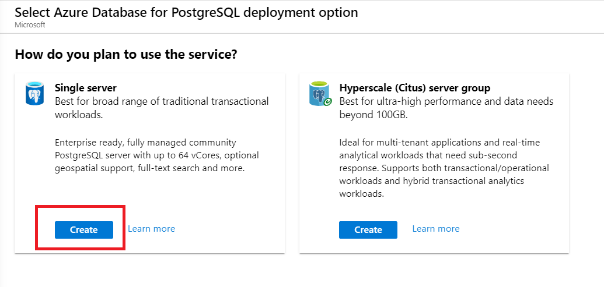

5. 使用以下输入来完成“单服务器基本信息”屏幕：

	- 订阅: 选择实验室订阅

	- 资源组: **DP-300-Lab02** （练习 1 中创建的 RG）

	- 服务器名称: **dp300-lab02-** **&lt;your initials&gt;** （服务器名称必须唯一）

	- 数据源: **无**

	- 位置: 选择距离你最近的区域，该区域已在整个实验室中使用

	- 版本: **10** 或 **11**

	- 单击“计算 + 存储”下的 **“配置服务器”** 链接

		- 单击 **“基本”** 选项卡

		- 将“vCore”滑块一直滑到最左侧以选择 **“1 个 vCore”**  
‎
	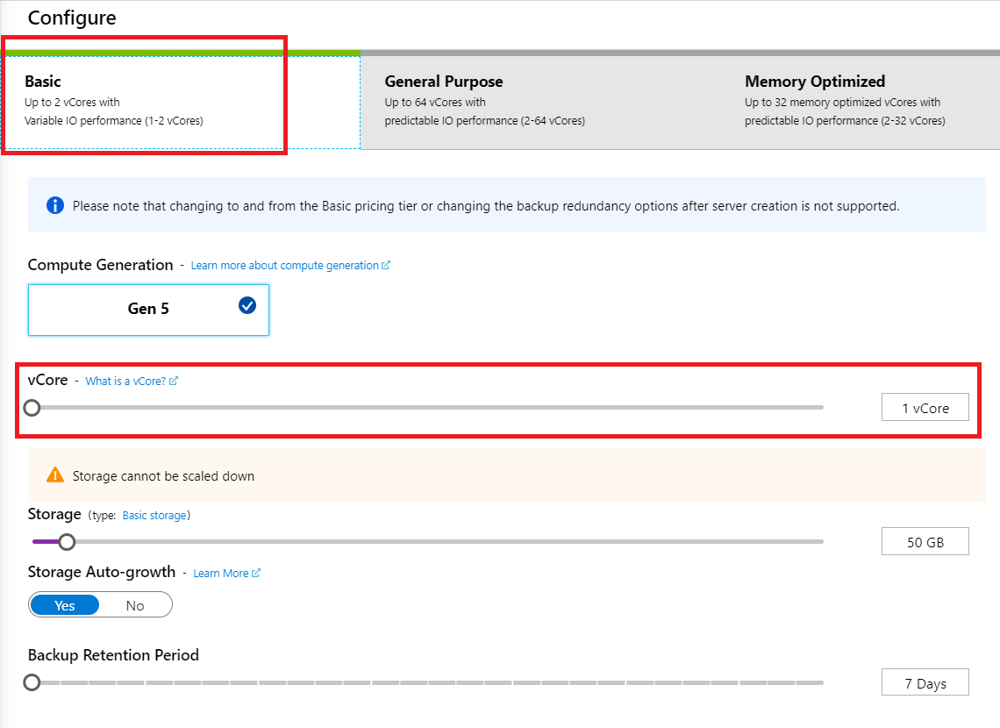

		- 单击 **“确定”**

	- 管理员用户名: **dp300admin**

	- 密码: **dp300P@ssword!**

	- 确认密码: **dp300P@ssword!**  
	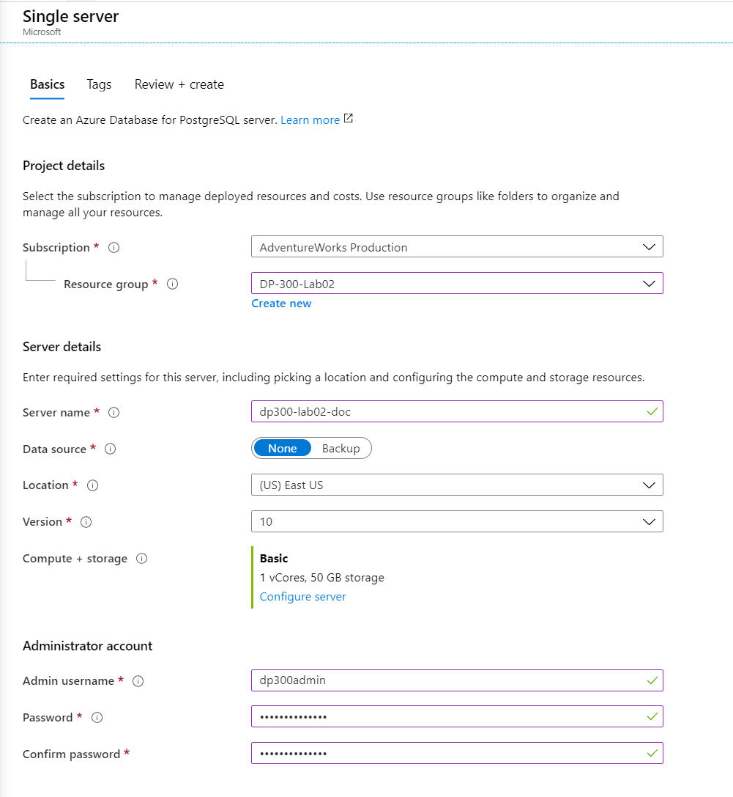

6. 单击 **“查看 + 创建”**。

7. 查看设置，然后单击 **“创建”**

8. 部署完成后，单击 **“转到资源”**。

## 任务 2：启用对 PostgreSQL 数据库的所有 Azure 服务访问

1. 单击数据库边栏中“设置”下的 **“连接安全”**  
‎
	

2. 将“允许访问 Azure 服务”设置滑动至 **“允许”**。  
‎
	

3. 在左上方单击 **“保存”**。

## 任务 3: 使用 Azure Data Studio 连接到 PostgreSQL 数据库

**注意：** 将 PostgreSQL 扩展安装到 ADS 后，可以查询 PostgreSQL。该扩展已预安装在实验室 VM 上。


1. 在实验室 VM 上的 Azure Data Studio 中，确保“连接”侧边栏已展开 - 如果未展开，请在左侧导航栏中单击 **“连接”** 按钮。

2. 单击 **“新建连接”** 按钮  
‎
	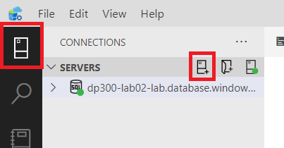

3. 在“连接详细信息”侧边栏中，输入以下信息以连接到先前任务的 PostgreSQL 数据库：

	- 连接类型: **PostgreSQL**

	- 服务器：输入任务 1 中创建的 PostgreSQL 服务器名称。例如: **dp300-lab02-doc.database.windows.net** （你可以在门户的“概述”窗格中找到服务器全名。）

	- 身份验证类型: **密码**

	- 用户名: **dp300admin @ dp300-lab02-doc** （请注意，用户名必须包含主机名） 

	- 密码: **dp300P@ssword!**

	- 数据库名称将仍未 **“&lt;default&gt;”**

	- 服务器组将保持 **&lt;default&gt;** 状态

	- 如果需要，可以使用数据库的易记名称填充名称（可选）

4. 查看设置  
‎
	

5. 单击 **“连接”**

6. 注意 ADS 与 PostgreSQL 数据库的连接  

	

 

 
