---
lab:
    title: '实验室 3 - 实现安全环境'
    module: '实现安全环境'
---

# 实验室 3 - 实现安全环境
 

**预计时长**： 60 分钟

**先决条件**： 在实验室中为模块 2 创建的 Azure SQL 服务器。订阅中的 Azure Active Directory 访问。 

**实验室文件**： 此实验室的文件位于“D:\Labfiles\Secure Environment”文件夹中。

# 实验室概述

学生将利用从课程和案例研究中获取的信息，在 Azure 门户和 AdventureWorks 数据库中进行配置，随后实现安全性。 

# 实验室目标

完成本实验后，你将能够：

1. 配置 Azure SQL 数据库防火墙

2. 使用 Azure Active Directory 授权对 Azure SQL 数据库的访问

3. 为 Azure SQL 数据库启用高级威胁检测

4. 为 Azure SQL 数据库配置数据分类

5. 管理对数据库对象的访问

# 应用场景

你已被聘为高级数据库管理员，帮助确保数据库环境的安全。这些任务侧重于 Azure SQL 数据库。 

 

## 练习 1： 配置 Azure SQL 数据库防火墙 

预计用时: 30 分钟

个人练习

本练习的主要任务如下：

1. 使用 Azure 门户配置基于服务器的防火墙规则

2. 部署数据库

3. 使用 T-SQL 添加数据库防火墙规则

4. 使用特定于数据库的连接字符串连接到该数据库

## 任务 1：    使用 Azure 门户配置基于服务器的防火墙规则

1. 在实验室虚拟机中，启动浏览器会话并导航到 [https://portal.azure.com](https://portal.azure.com/)。提供适当的凭据。 

	

2. 在 Azure 门户顶部的搜索栏中，键入 SQL。SQL 服务器图标将出现。单击 SQL 服务器。单击服务器名称，前往你在实验室 2 中创建的服务器的详细信息页面


	

 

3. 在 SQL Server 的详细信息屏幕中，将鼠标移到服务器名称右侧，然后单击“复制到剪贴板”按钮，如下所示。


	

4. 单击在复制到剪贴板时单击的服务器名称上方的“显示防火墙设置”。单击下面突出显示的“+ 客户端 IP”，然后单击“保存”。

 

	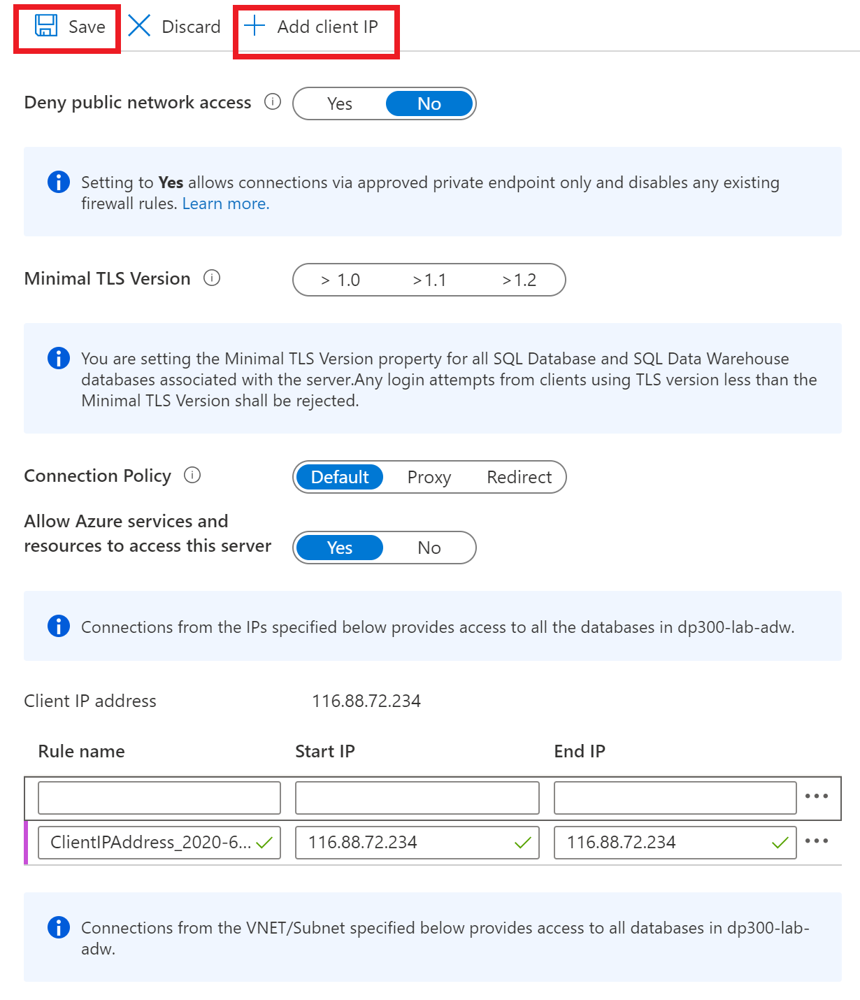

	这将你能够使用 SQL Server Management Studio 或任何其他客户端工具连接到 Azure SQL 数据库服务器。记下你的客户端 IP 地址，稍后将在此任务中使用它。

5. 通过从“开始”菜单导航到“Microsoft SQL Server Tools 18”>“SQL Server Management Studio”，在实验室 VM 上打开 SQL Server Management Studio。粘贴你的 Azure SQL 数据库服务器名称，并使用在实验室 2 中创建的凭据登录：

	- 服务器管理员登录名: **dp300admin**

	- 密码: **dp300P@ssword!**

 
	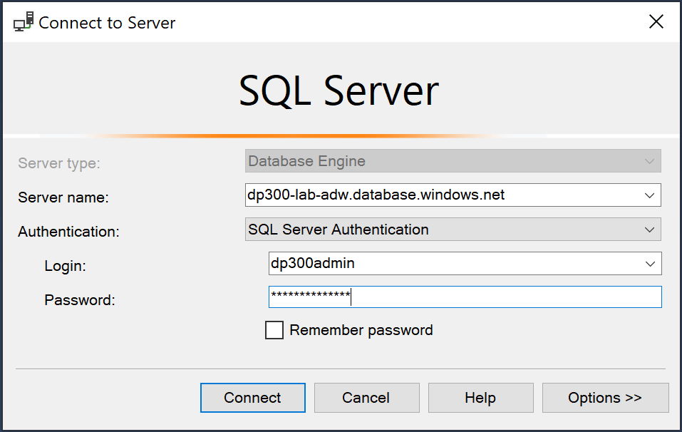

	单击“连接”。

6. 在“对象资源管理器”中，展开服务器节点，然后右键单击数据库。单击“导入数据层应用程序”。

	

 
7. 在“导入数据层应用程序”对话框中，点击第一个屏幕中的“下一步”。 

 
	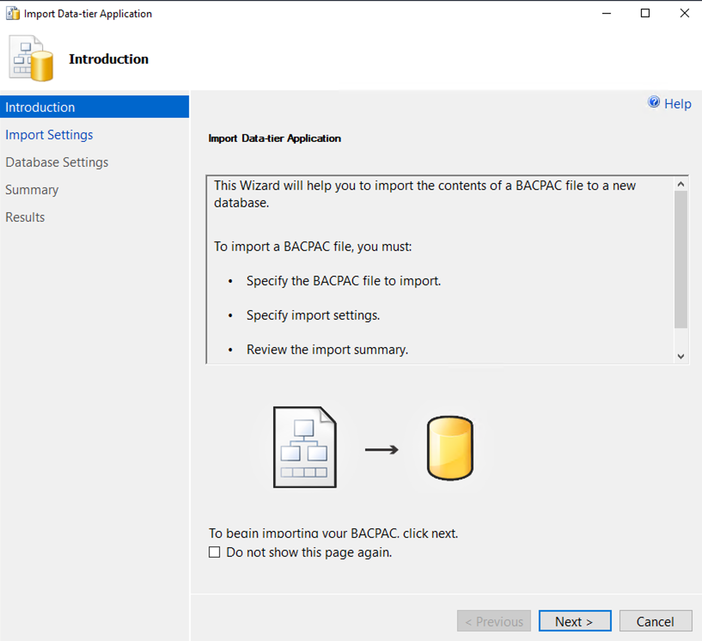

 

8. 在“导入设置”屏幕中，单击“浏览”并导航到“D:\Labfiles\Secure Environment”文件夹，再单击 AdventureWorks.bacpac 文件，然后单击“打开”。然后在“导入数据层应用程序”屏幕中，单击 **“下一步”**。

	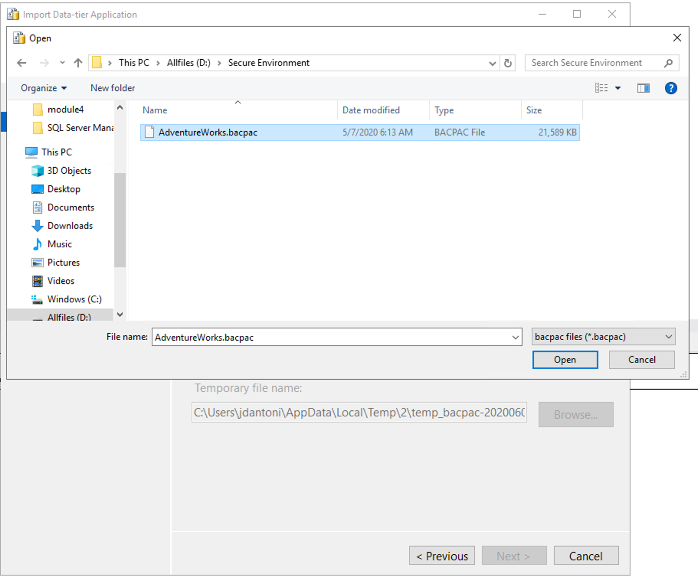

	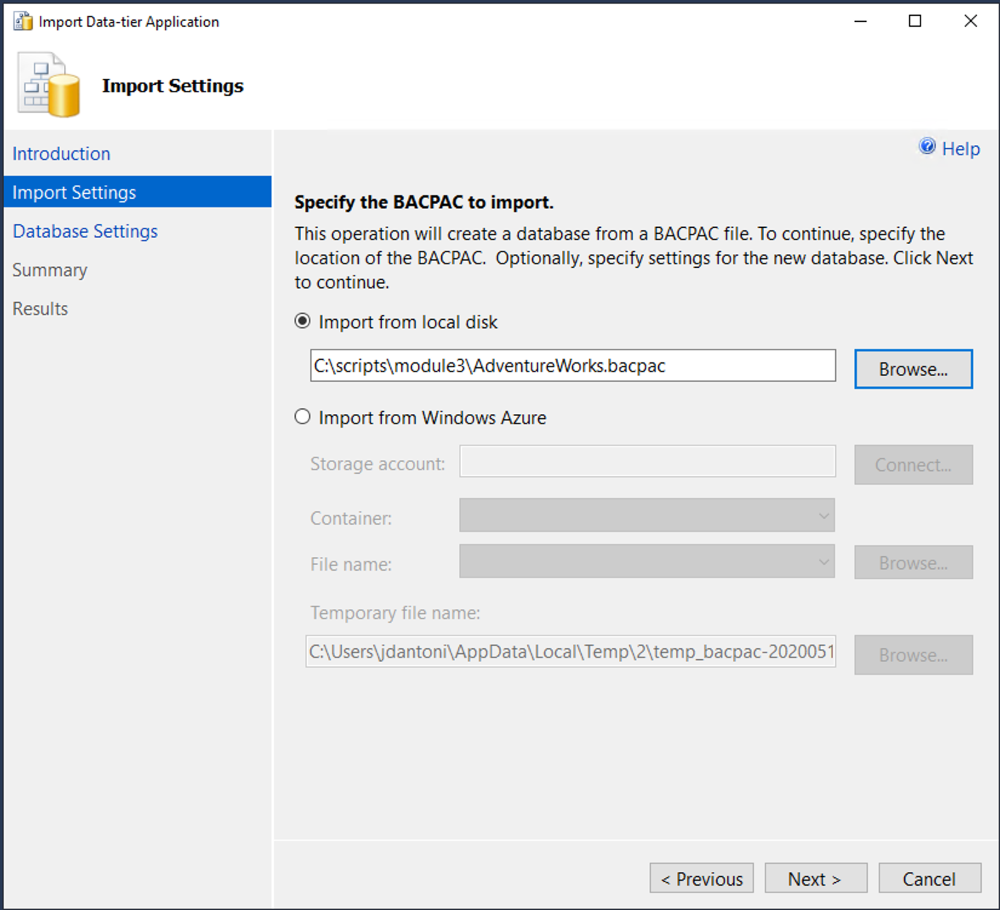

 

9. 在数据库设置屏幕上，将 Azure SQL 数据库的版本更改为“常规用途”。将服务目标更改为 GP_Gen4_2，然后单击“下一步”。 

 

	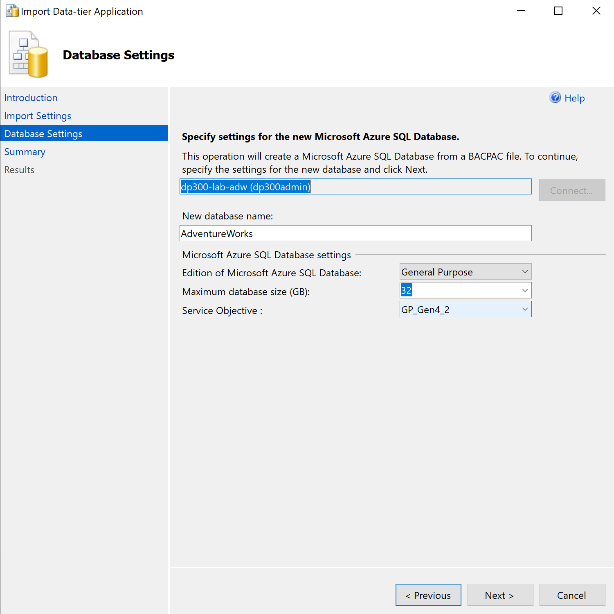

 

10.  单击 **“下一步”**，然后在“摘要”屏幕上单击 **“完成”**。导入完成后，将看到以下结果。
	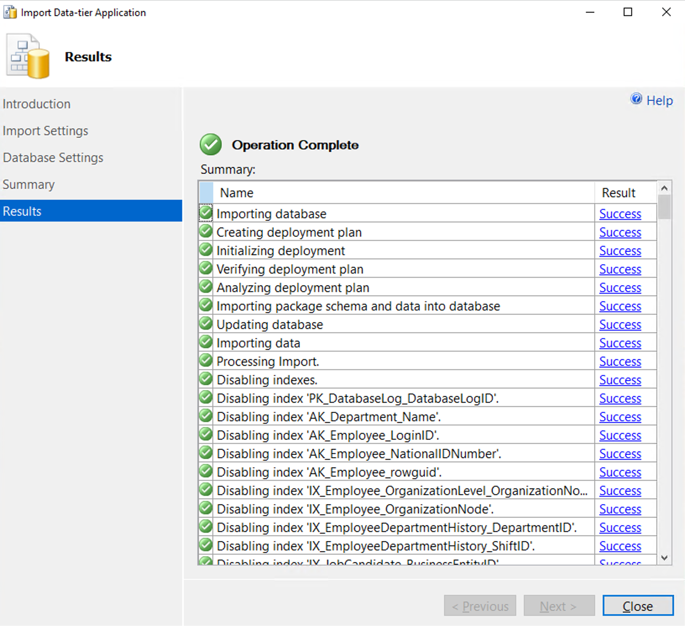


11. 在对象资源管理器中，右键单击 AdventureWorks，然后单击“新建查询”。 

 

	

 

12. 通过将文本粘贴到查询窗口中并单击“执行”或按 F5 键来执行以下 T-SQL 查询。

	```sql
	EXECUTE sp_set_database_firewall_rule @name = N'ContosoFirewallRule',

	@start_ip_address = '192.168.1.1', @end_ip_address = '192.168.1.1'
	```
	

	将 192.168.1.1. 替换为步骤 4 中的客户端 IP 地址。接下来，将在 AdventureWorks 数据库中创建一个包含用户。单击“新建查询”，然后执行以下 T-SQL。确保正在使用 AdventureWorks 数据库。如果在下面突出显示的框中看到 master，则可以下拉并切换到 AdventureWorks。


	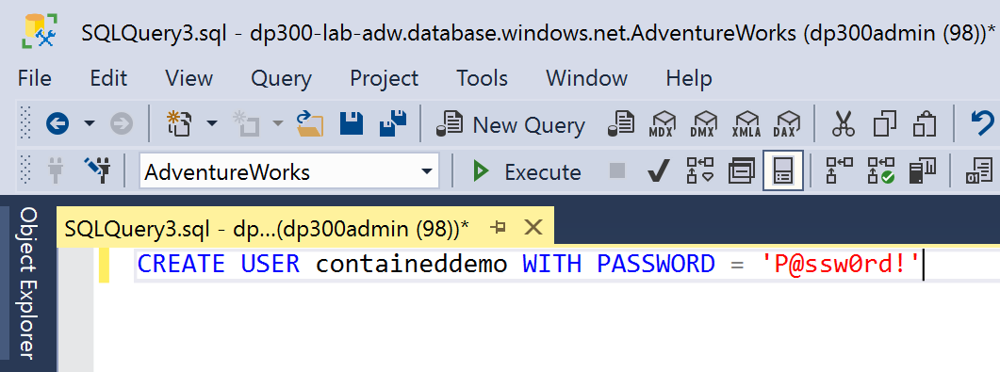

13. 单击“执行”运行此命令。此命令会在 AdventureWorks 数据库中创建一个包含的用户。将在下一步中使用此用户名和密码登录。

	```sql
	CREATE USER containeddemo WITH PASSWORD = 'P@ssw0rd!'
	```


14. 导航到 SSMS 中的对象资源管理器，然后单击“连接”，再单击“数据库引擎”

	

15. 。尝试使用步骤 13 创建的凭据建立连接。将看到以下错误。


	

	这是因为该连接尝试登录 master 数据库，而不是创建用户的 AdventureWorks。若要更改连接上下文，请单击“确定”退出错误消息，然后单击“连接到服务器”对话框中的选项，如下所示。


	


16. 在“连接选项”选项卡上，键入数据库名称“AdventureWorks”。


	


17. 从该屏幕单击”连接“。此连接绕过 master 数据库，直接登录到 AdventureWorks，这是新创建的用户唯一有权访问的数据库。

	

## 任务 2：使用 Azure Active Directory 授权对 Azure SQL 数据库的访问

1. 导航到 Azure 门户，然后在屏幕右上角单击你的用户名。


	


	记下该用户名。 

 

2. 在 Azure 门户中，导航到 Azure SQL 数据库服务器 dp300-lab-xx，然后单击“Active Directory 管理员”旁边的“未配置”。


	


	在下一个屏幕上，单击“设置管理员”。 


	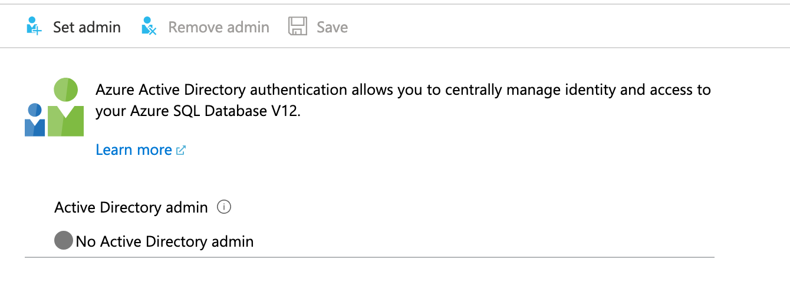

	在“设置管理员”屏幕中，搜索你的用户名。找到它后，单击它以突出显示用户名，然后单击“选择”。这将返回到上面的 Active Directory 管理员屏幕。单击“保存”完成该过程。这样，你的用户名将成为服务器的 Azure Active Directory 管理员，如下所示 


	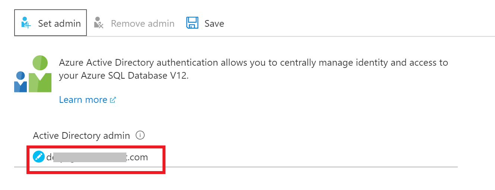


3. 打开 SQL Server Management Studio，然后单击“连接”>“数据库引擎”。在“服务器名称”中，输入你的服务器名称。将身份验证类型更改为“Azure Active Directory 通用且具有 MFA 支持”。


	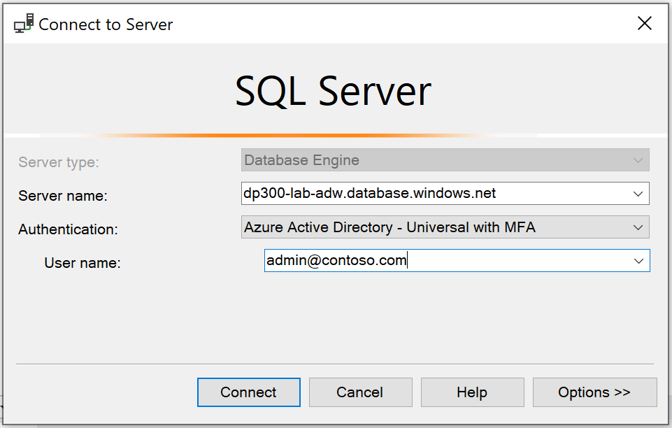

	

	按提示输入 Azure Active Directory 密码，然后登录数据库。 

 

## 任务 3 启用高级数据安全和数据分类

1. 从 Azure SQL 服务器的主边栏选项卡中，导航到“安全”部分，然后单击“高级数据安全”。 
 

	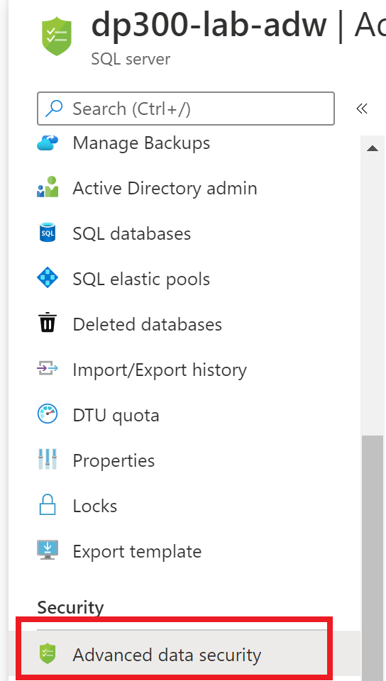

	
	单击“高级数据安全”下的切换开关，切换到“开”。单击“存储帐户”。


	

	

	系统将提示创建存储帐户。选择在实验室 1 中创建的存储帐户。将执行定期扫描开关切换到“开”。选择一个用于接收扫描报告和警报的电子邮件帐户。取消选中“也向管理员和订阅所有者发送电子邮件通知”复选框。
 


	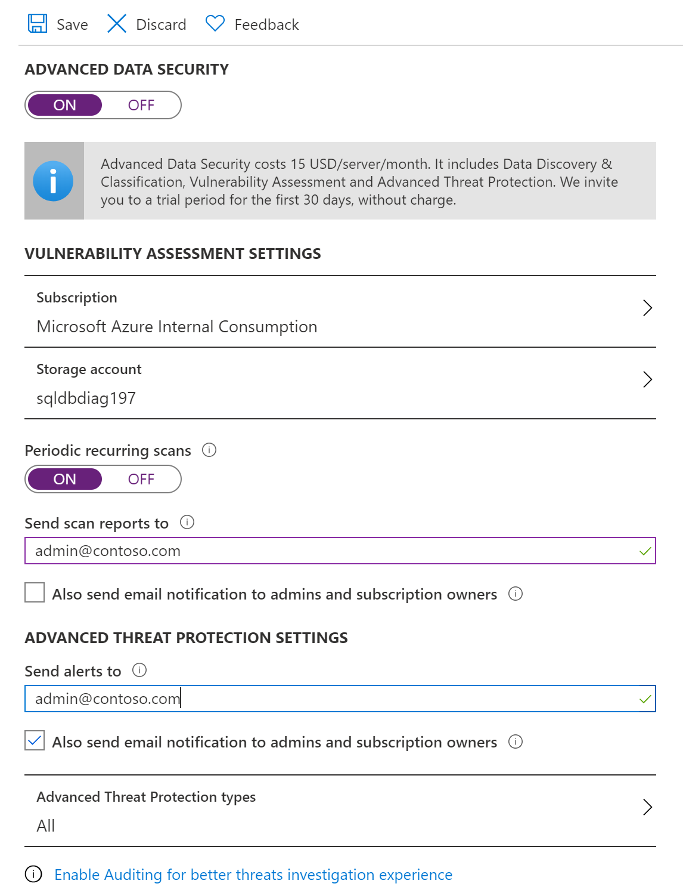

	单击“高级威胁检测”类型，然后查看各选择。保持选中所有框，然后单击屏幕顶部的 **“保存”**。


2. 在 Azure SQL 服务器的概述屏幕中向下滚动并单击数据库名称，从而导航到 Azure 门户中的 AdventureWorks 数据库。 


	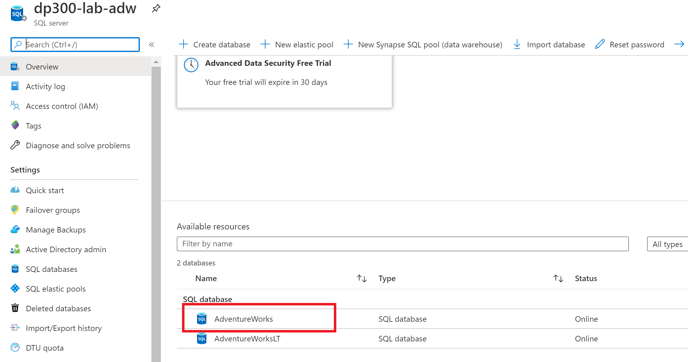


3. 导航到 Azure SQL 数据库主边栏选项卡的“安全”部分，然后单击“高级数据安全”。在“高级数据安全”屏幕中，单击“数据发现和分类”。


	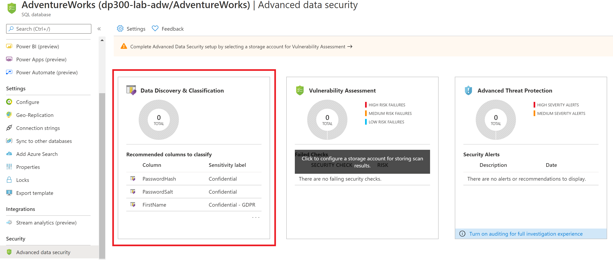

	下一个屏幕会显示一条信息性消息，内容为“已找到 32 个附带分类建议的列”。单击该链接。

	
	


	在下一个屏幕中，单击“全选”旁边的复选框，然后单击“接受已选建议”。 


	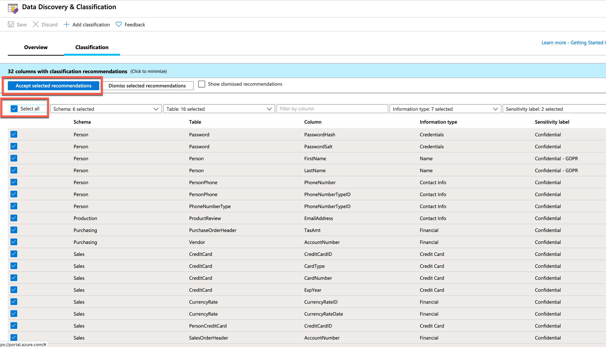

	

	单击 **“保存”**，将各分类保存到数据库中。 

 

4. 返回到你的 VM 上的 SQL Server Management Studio。从 AdventureWorks 数据库启动新的查询窗口，然后执行以下查询。

 
	```sql
	SELECT o.name AS [Table Name]

	,ac.name AS [Column Name]

	,sc.label

	,sc.information_type

	FROM sys.sensitivity_classifications sc

	INNER JOIN sys.objects o ON o.object_id = sc.major_id

	INNER JOIN sys.all_columns ac ON ac.column_id = sc.minor_id

	WHERE ac.object_id = o.object_id;
	```
	

	此查询将返回分类列的结果，如下所示。

	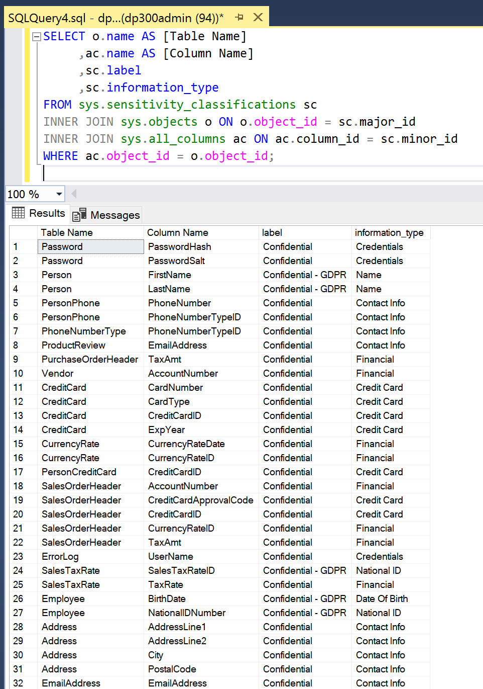

 

## 任务 4：管理对数据库对象的访问

1. 在此任务中，你将管理对数据库及其对象的访问。首先要做的是在 AdventureWorks 数据库中创建两个用户。打开一个新的查询窗口，然后将下面的 T-SQL 复制并粘贴到其中。执行查询以创建两个用户。

```sql
CREATE USER [DP300User1] WITH PASSWORD = 'Azur3Pa$$'

GO

CREATE USER [DP300User2] WITH PASSWORD = 'Azur3Pa$$'

GO
```
 

你会注意到这些用户是在数据库范围内创建的。因此，如果尝试使用其中一个用户登录，则需要在连接字符串中指定 AdventureWorks 数据库。


2. 接下来，你将创建一个自定义角色并向其添加用户。在与步骤 1 相同的查询窗口中执行以下 T-SQL。

```sql
CREATE ROLE [SalesReader]

GO

ALTER ROLE [SalesReader] ADD MEMBER [DP300User1]

GO

ALTER ROLE [SalesReader] ADD MEMBER [DP300User2]

GO
```

3. 下一步是为该角色授予权限。在本例中，要为 Sales 架构分配 SELECT 和 EXECUTE。执行以下 T-SQL 向该角色授予权限。

```sql
GRANT SELECT, EXECUTE ON SCHEMA::Sales TO [SalesReader]

GO
```
 

4. 接下来，将在 Sales 架构中创建一个新的存储过程。你会注意到此过程会访问 Product 架构中的一个表。在查询窗口中执行以下 T-SQL。

```sql
CREATE OR ALTER PROCEDURE Sales.DemoProc

AS

SELECT P.Name, Sum(SOD.LineTotal) as TotalSales ,SOH.OrderDate 

FROM Production.Product P

INNER JOIN Sales.SalesOrderDetail SOD on SOD.ProductID = P.ProductID

INNER JOIN Sales.SalesOrderHeader SOH on SOH.SalesOrderID = SOD.SalesOrderID

GROUP BY P.Name, SOH.OrderDate

ORDER BY TotalSales DESC

GO
```
 

5. 接下来，将使用 EXECUTE AS USER 语法测试刚刚建立的安全性。这使数据库引擎可以在你的用户上下文中执行查询。在查询窗口中执行以下查询。

```sql
EXECUTE AS USER = 'DP300User1'


SELECT P.Name, Sum(SOD.LineTotal) as TotalSales ,SOH.OrderDate 

FROM Production.Product P

INNER JOIN Sales.SalesOrderDetail SOD on SOD.ProductID = P.ProductID

INNER JOIN Sales.SalesOrderHeader SOH on SOH.SalesOrderID = SOD.SalesOrderID

GROUP BY P.Name, SOH.OrderDate

ORDER BY TotalSales DESC
```
 

该查询将失败，并显示一条错误消息，提示对 Production.Product 表的 SELECT 权限遭到拒绝。用户 DP300User1 所属的角色在 Sales 架构中具有 SELECT 权限，但在 Production 架构中则不具有此权限。 


但是，如果在相同的上下文中执行存储过程，查询将完成。执行以下 T-SQL。

```sql
EXECUTE AS USER = 'DP300User1'

EXECUTE Sales.DemoProc
```
 

这是因为存储过程利用了一种称为“所有权链接”的功能，向没有数据库对象直接访问权限的用户提供数据访问权限。对于属于同一所有者的所有对象，数据库引擎仅检查过程的 EXECUTE 权限，而不检查基础对象的这一权限。 


**请不要删除本实验室中创建的任何资源，因为它们将在后续的实验室练习中使用。** 
