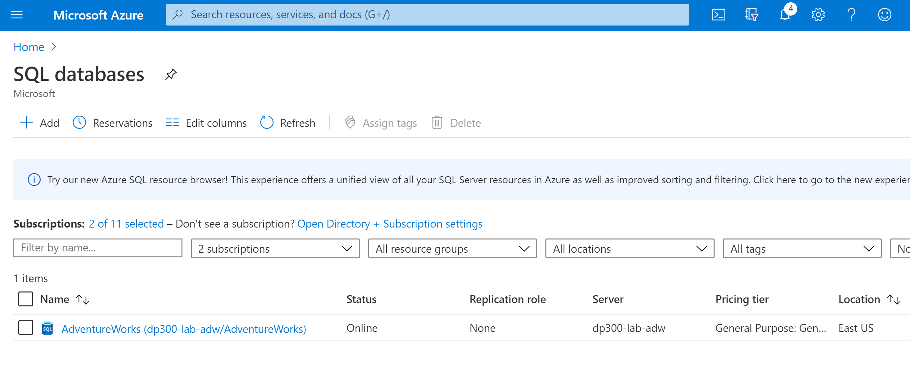
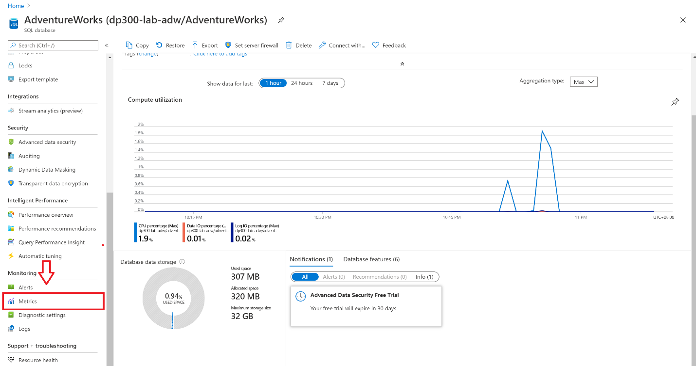
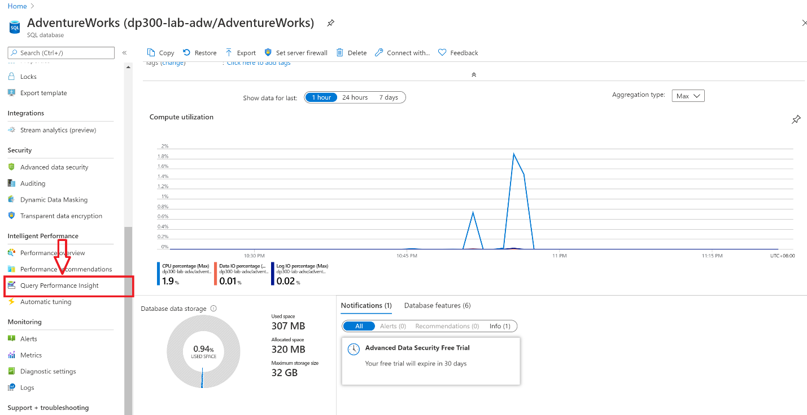
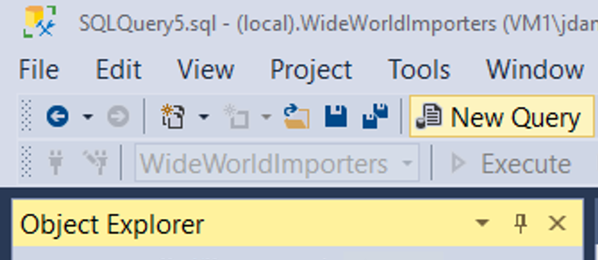
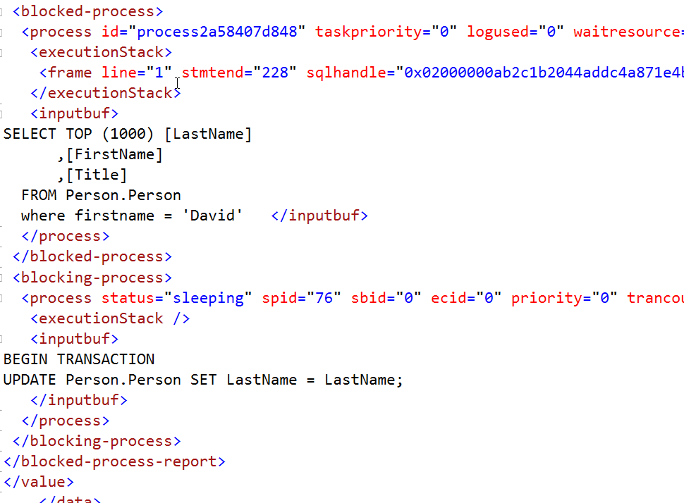

---
lab:
    title: '实验室 4 – 监控和优化资源'
    module: '监控和优化运营资源'
---

# 实验 4 – 监视和优化资源


**预计时长**: 60 分钟

**先决条件**: 在实验室 2 和 3 中创建的实验室 VM 和 Azure SQL 数据库


# 实验室概述


学生将获取从课程和案例研究中获得的信息，以确定 AdventureWorks 中数字转换项目的可交付成果。通过检查 Azure 门户以及其他工具，学生将确定如何利用本机工具来识别和解决与性能相关的问题。最后，学生将能够识别数据库中的碎片，并学习恰当解决问题的步骤。 


# 实验室目标


完成本实验后，你将能够：

1. 通过监视隔离性能问题。 

2. 通过创建一个新的索引，利用查询存储来定位和解决阻塞问题

3. 检测并纠正碎片问题。 


# 应用场景


你已被聘为数据库管理员，可识别与性能有关的问题，并提供可行的解决方案来解决发现的所有问题。十多年来，AdventureWorks 一直将自行车和自行车零件直接销售给最终用户和分销商。该公司在 Azure 虚拟机中同时使用 Azure SQL 数据库和 SQL Server。最近，该公司注意到用于满足客户要求的两种产品的性能下降了。你需要使用 Azure 门户以及本地工具来识别性能问题，并提出解决问题的方法。 


# 练习 1: 通过监控隔离问题


预计用时：25 分钟

本练习的主要任务如下：

1. 查看监视解决方案以识别与 Azure SQL 数据库性能相关的问题

2. 使用查询存储可识别任何正在进行的阻塞问题，并标识适当的索引去实施以解决阻塞问题。 

3. 使用查询工具来识别索引碎片，并提供一种解决碎片的方法。 

 

## 任务 1: 在 Azure 门户中查看CPU利用率

1. 导航回 portal.azure.com。你可能需要再次登录。在 Azure 门户顶部的搜索栏中，键入“SQL”，然后单击 SQL 数据库。该任务将使用你在实验3中创建的 AdventureWorks 数据库。单击数据库名称。


    


2. 在 AdventureWorks 数据库的边栏选项卡的“监视”部分找到指标图标。 

    

3.  更改“指标”菜单选项以反映 CPU 百分比

 
    

4. 选择“平均”总量。这将显示给定时间范围内的平均 CPU 百分比。 

5. 现在，将聚合调整为“最大”以识别给定时间范围内使用的最大 CPU 百分比。与平均值有何不同？

## 任务 2：识别高 CPU 消耗查询

1. 在第一个任务所示的同一视图中，在同一菜单中选择“Query Performance Insight”

    

    

2.  单击图表下方网格中的第一个查询。 


    

3. 记录查询及其资源使用情况，如下图所示。Azure 跟踪每个查询的 CPU、数据 IO 和日志 IO。

 
    


# 练习 2: 识别并解决阻塞问题


预计用时: 15 分钟

个人练习

本练习的主要任务如下：

1. 通过使用带有扩展事件的阻止报告，来确定哪个查询导致了阻止

2. 确定可以实施以解决阻塞的索引

## 任务 1: 运行已阻止查询报告

1.  在实验室 VM 中，打开开始菜单并导航到“Microsoft SQL Server Tools 18”>“Microsoft SQL Server Management Studio”，打开 SQL Server Management Studio。 

2. 在 Management Studio 中单击“新建查询”按钮，启动新查询。

    

    系统将提示你连接到 SQL Server。


    

    输入 LON-SQL1 作为本地服务器名称，并确保选定“ Windows 身份验证”，然后单击“连接”。


3. 将以下代码复制并粘贴到查询窗口中。 

 
    ```sql
    USE MASTER

    GO

    CREATE EVENT SESSION [Blocking] ON SERVER 

    ADD EVENT sqlserver.blocked_process_report(

    ACTION(sqlserver.client_app_name,sqlserver.client_hostname,sqlserver.database_id,sqlserver.database_name,sqlserver.nt_username,sqlserver.session_id,sqlserver.sql_text,sqlserver.username))

    ADD TARGET package0.ring_buffer

    WITH (MAX_MEMORY=4096 KB, EVENT_RETENTION_MODE=ALLOW_SINGLE_EVENT_LOSS, MAX_DISPATCH_LATENCY=30 SECONDS, MAX_EVENT_SIZE=0 KB,MEMORY_PARTITION_MODE=NONE, TRACK_CAUSALITY=OFF,STARTUP_STATE=ON)

    GO

    -- Start the event session 

    ALTER EVENT SESSION [Blocking] ON SERVER 

    STATE = start; 

    GO
    ```

    单击执行按钮以执行该查询。 

    上面的 T-SQL 代码将创建一个扩展事件会话，该会话将捕获阻止事件。数据将包含以下元素：

    - 客户端应用程序名称

    - 客户端主机名

    - 数据库 ID

    - 数据库名称

    - NT 用户名

    - 会话 ID

    - T-SQL 文本

    - 用户名


4. 在 SQL Server Management Studio 中单击“新建查询”。将下面的 T-SQL 代码复制并粘贴到查询窗口中。单击“执行”按钮以执行此查询。 

    ```sql
    USE AdventureWorks2017

    GO

    BEGIN TRANSACTION

    UPDATE Person.Person SET LastName = LastName;

    GO
    ```
 

5. 单击“新建查询”按钮以打开另一个查询窗口。将以下 T-SQL 代码复制并粘贴到查询窗口中。单击“执行”按钮以执行此查询。 

    ```sql
    USE AdventureWorks2017

    GO

    SELECT TOP (1000) [LastName]

    ,[FirstName]

    ,[Title]

    FROM Person.Person

    where FirstName = 'David'
    ```
    

    你应该注意，该查询不会立即返回结果，并且似乎仍在运行。


6. 在对象资源管理器中，导航到“管理”，然后通过单击加号来展开配置单元。展开“扩展事件”配置单元，然后展开“会话”配置单元。展开在步骤 3 中创建的“阻止”会话。右键单击 package0.ring_buffer 并选择查看目标数据。 

    

7. 单击此超链接。 

    

8. XML 将向你显示哪些进程被阻止以及哪个进程导致阻止。 

    

9.  右键单击扩展事件会话，然后选择“停止会话”。 

10.  导航回到你在步骤 4 中打开的“查询”选项卡，并在查询的下一行键入“ROLLBACK TRANSACTION”。突出显示 ROLLBACK TRANSACTION 并单击执行该命令。

    

11. 导航回到在步骤 5 中打开的查询标签。你会注意到查询已完成。

## 任务 2：启用读取提交快照隔离

1. 将以下 T-SQL 代码复制并粘贴到查询窗口中。单击“执行”按钮以执行此查询。 

```sql
USE master

GO

ALTER DATABASE AdventureWorks2017 SET READ_COMMITTED_SNAPSHOT ON WITH ROLLBACK IMMEDIATE;

GO
```
2.  开始对 AdventureWorks2017 数据库的新查询。将以下 T-SQL 代码复制并粘贴到查询窗口中。单击“执行”按钮，或者按 t 键执行此查询。 
```sql
USE AdventureWorks2017

GO

BEGIN TRANSACTION

UPDATE Person.Person SET LastName = LastName;

GO
```
 

3. 针对 AdventureWorks2017 数据库启动另一个新查询。将以下 T-SQL 代码复制并粘贴到查询窗口中。单击“执行”按钮以执行此查询。 

```sql
USE AdventureWorks2017

GO

SELECT TOP (1000) [LastName]

 ,[FirstName]

 ,[Title]

 FROM Person.Person

 where firstname = 'David'
```

4. 与讲师讨论为什么步骤 3 中的查询现已完成，而在上一个练习中，它被 UPDATE 所阻止。 


# 练习 3：检测/纠正碎片问题


预计用时：15 分钟

个人练习

本练习的主要任务如下：

1. 选择其中一个要求，并确定要执行哪些高级任务来满足所选的数据要求。

2. 教师将与小组讨论结果。

## 任务 1：识别碎片

1. 在实验室 VM 上启动 SQL Server Management Studio。输入服务器名称   
DP-300-SQL1，确保选定“Windows 身份验证”，然后单击“连接”。单击“新建查询”按钮。将以下 T-SQL 代码复制并粘贴到查询窗口中。单击“执行”按钮以执行此查询。 

```sql
USE AdventureWorks2017
GO

INSERT INTO [Person].[Address]

 ([AddressLine1]

 ,[AddressLine2]

 ,[City]

 ,[StateProvinceID]

 ,[PostalCode]

 ,[SpatialLocation]

 ,[rowguid]

 ,[ModifiedDate])

SELECT AddressLine1,

 AddressLine2, 

 'Amsterdam',

 StateProvinceID, 

 PostalCode, 

 SpatialLocation, 

 newid(), 

 getdate()

from Person.Address;


GO
```
该查询将增加 Person.Address 表及其索引的碎片级别。


2. 将以下 T-SQL 代码复制并粘贴到查询窗口中。单击“执行”按钮以执行此查询。 

```sql
USE AdventureWorks2017

GO

SELECT i.name Index_Name

 , avg_fragmentation_in_percent

 , db_name(database_id)

 , i.object_id

 , i.index_id

 , index_type_desc

FROM sys.dm_db_index_physical_stats(db_id('AdventureWorks2017'),object_id('person.address'),NULL,NULL,'DETAILED') ps

 INNER JOIN sys.indexes i ON ps.object_id = i.object_id 

 AND ps.index_id = i.index_id

WHERE avg_fragmentation_in_percent > 50 -- find indexes where fragmentation is greater than 50%
```
 
此查询将报告碎片超过 50％ 的所有索引。你应该会看到四个带有碎片的索引。


3. 将以下 T-SQL 代码复制并粘贴到查询窗口中。单击“执行”按钮执行此查询。 

```sql
SET STATISTICS IO,TIME ON

GO

USE AdventureWorks2017

GO

SELECT DISTINCT (StateProvinceID)

 ,count(StateProvinceID) AS CustomerCount

FROM person.Address

GROUP BY StateProvinceID

ORDER BY count(StateProvinceID) DESC;

GO
```
 

单击 SQL Server Management Studio 结果窗格中的“消息”选项卡。记录查询执行的逻辑读取的计数。 

[手机的屏幕截图；描述自动生成](images/dp-3300-module-44-lab-14.png)

## 任务 2：重新生成索引

1. 单击“新建查询”按钮。将以下 T-SQL 代码复制并粘贴到查询窗口中。单击“执行”按钮以执行此查询。 


2. 将以下 T-SQL 代码复制并粘贴到查询窗口中。单击“执行”按钮以执行此查询。 

```sql
USE AdventureWorks2017

GO

ALTER INDEX [IX_Address_StateProvinceID] ON [Person].[Address] REBUILD PARTITION = ALL WITH (PAD_INDEX = OFF, STATISTICS_NORECOMPUTE = OFF, SORT_IN_TEMPDB = OFF, IGNORE_DUP_KEY = OFF, ONLINE = OFF, ALLOW_ROW_LOCKS = ON, ALLOW_PAGE_LOCKS = ON)
```
 

3. 重新执行任务 1 中步骤 3 中的查询。确认 AK_Address_StateProvinceID 索引不再具有大于 50％ 的碎片。 

4. 重新执行任务 1 中步骤 4 中的查询。记录 Management Studio “结果”窗格的“消息”选项卡中的逻辑读取次数。重新生成索引之前遇到的逻辑读取次数是否有变化？ 
