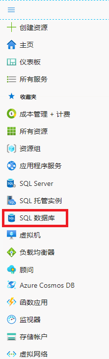
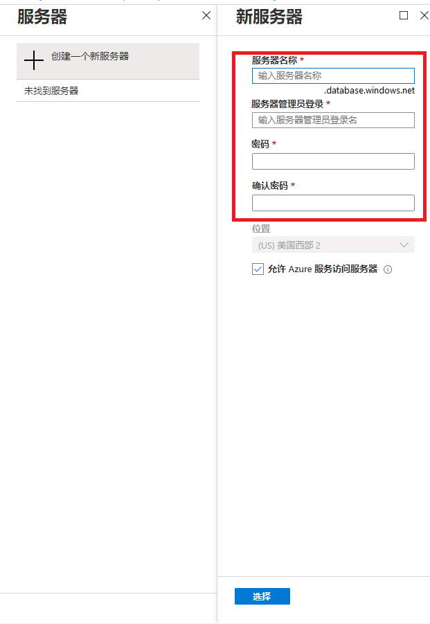
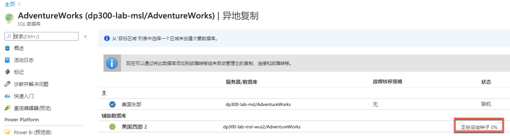
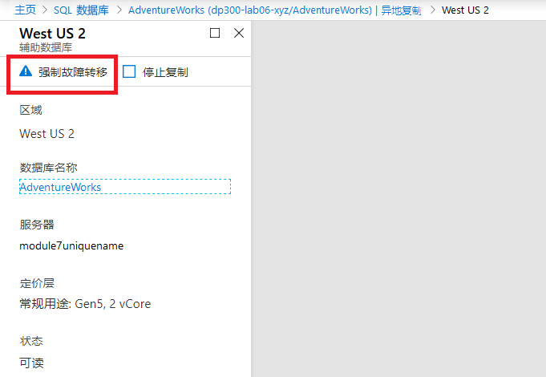
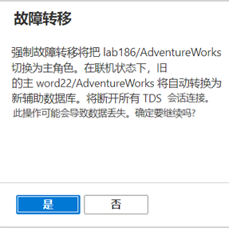
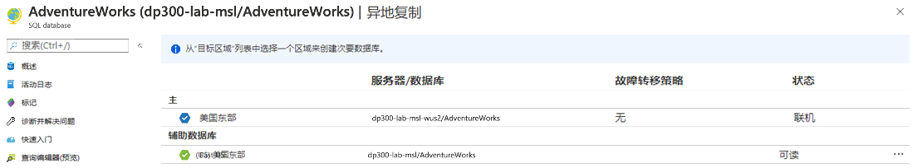
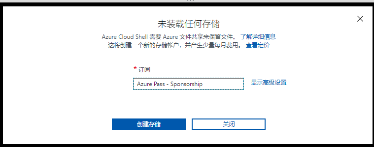

---
lab:
    title: '实验7 – 规划和实施高可用性和灾难恢复环境'
    module: '规划和实现高可用性和灾难恢复'
---

# 实验室 7 – 规划和实现高可用性和灾难恢复环境

**预计时长**: 60 - 90 分钟

**先决条件**: 练习 1 使用的 Azure SQL 数据库是在实验室中为模块 3 创建的。 

**实验室文件**：本实验室的文件位于“D:\Labfiles\High Availability”文件夹中。

# 实验室概述

学生将执行两个主要任务：使 Azure SQL 数据库异地冗余，并备份到使用 Azure 的 URL 并从其中还原。 

# 实验室目标

完成本实验后，你将能够：

1. 为 Azure SQL 数据库启用异地复写

	- 配置异地复写

	- 在区域之间执行故障转移

2. 使用 URL 备份和还原 SQL Server 数据库

	- 创建共享访问签名 (SAS)

	- 配置备份到网址

	- 将数据库备份到 URL

	- 从 URL 还原数据库

# 应用场景

作为高级数据工程师，你已经在上一个实验室中完成了日常的自动化任务，现在的任务是为数据库环境提升 IaaS 和 PaaS 配置的可用性。你的任务是实现以下目标：

1. 为 Azure SQL 数据库启用异地复制，以提高数据库的可用性。

2. 将数据库备份到 Azure 中的 URL，并在发生人为错误后将其还原。


# 练习 1：为 Azure SQL 数据库启用异地复制

概述

学生们将修改在模块 3 的实验室中创建的 Azure SQL 数据库配置，以使其高度可用。

实验室目标

学生可进行以下操作： 

- 使用门户为 Azure SQL DB 启用异地复写

- 测试包括故障转移的异地复写

应用场景

作为 WideWorldImporters 中的 DBA，你需要知道如何为 Azure SQL 数据库启用异地复制，并确保其正常运行，并知道如何使用门户手动将其故障转移到另一个区域。

先决条件

- 为学生创建的 Azure 帐户 – 必须提供登录名（电子邮箱）和密码

- 预先创建的 Azure SQL Database 服务器和数据库

 

1. 如果未通过浏览器窗口登录 Azure 门户，请使用提供的 Azure 凭据进行登录。

2. 从菜单中选择 SQL 数据库，如下所示。

	

3. 单击在实验室 3 中创建的 Azure SQL 数据库。以下是一个示例。

	

 

4. 在数据库的边栏选项卡中，选择“异地复写”。 

	

	数据库当前配置的区域在表中显示为带有白色复选标记的蓝色六边形，如下所示。你会发现未配置异地复写。

	

5. 在边栏选项卡的底部，选择目标区域。所有可用区域都有一个绿色轮廓的六边形。

	

6. 此示例中选择了“美国西部 2”，可在“创建辅助”边栏选项卡上查看。选择目标服务器。

	

7. 在“新建服务器”边栏选项卡上，输入 module7geo<unqiueguid> 的名称、有效的管理员登录名和安全密码。  完成后单击“选择”。

	

8. 请在“创建”辅助边栏选项卡上单击 **“确定”**。现在将创建辅助服务器和数据库。如要检查状态，请在门户顶部的铃图标下方查看。如果成功，它将从进行中的部署升级到成功的部署。 

	


	请注意，在表的状态列中，状态将从“正在初始化”变为“成的种子设定百分比”（如下所示），直至复制同步时变为“可读”

	

9. 现在，已经为 Azure SQL 数据库配置了异地复写，可执行故障转移。选择辅助服务器（West US2，如上图所示，但你也可以选择其他区域）。

10. 在边栏选项卡上，单击“强制故障转移”。

	

11. 出现提示时，单击“是”。 

	


	主副本的状态将切换为“挂起”，而辅助副本的状态将切换为“故障转移”。此进程应该只需要几分钟。完成后，角色将切换，而辅助节点将变为新的主要节点，而旧的节点将成为辅助节点。

	


# 练习 2：备份到 URL 并从网址还原

预计用时：15 - 30 分钟

本练习的任务如下所示：

1. 配置备份到 URL

2. 备份 WideWorldImporters

3. 还原 WideWorldImporters

## 任务 1：配置备份到 URL

在将 SQL Server 中的数据库备份到 Azure 之前，需要执行一些配置任务。

1. 切换到 LON-SQL1 的远程桌面会话。

2. 启动 Edge。

3. 如还未登录，请使用已提供的凭据登录到 Azure 门户 ([https://portal.azure.com](https://portal.azure.com/))。 

4. 选择下图右上角所示的图标，打开 Cloud Shell 提示。

	

5. 如果你尚未使用 Cloud Shell，则可能在门户的下半部分看到一条欢迎使用 Azure Cloud Shell 的消息。选择 。

	

6. 如果你以前没有使用过 Cloud Shell，则必须为其提供存储空间。在下面的对话框中单击“创建存储”。

	


7. 如果已经使用过 Cloud Shell，则只需确保 Cloud Shell 屏幕的上级角落会显示 Bash。你可以使用下拉箭头选择 PowerShell 或 Bash。 
 

	完成后，你将看到类似于以下内容的提示。

	


8. 通过在 Cloud Shell 中执行以下命令，从 CLI 创建存储帐户。

	```
	az storage account create -n dp300storage -g DP-300-Lab02 --kind StorageV2 -l eastus2
	```

	存储帐户名称必须唯一，其中所有字母均小写，并且不能包含特殊字符。你应该将上面的 dp300storage 更改为一个唯一的名称，例如 dp300storagemsl123。值 dp300lab06 是资源组的名称。确保使用的数据库已在之前的实验室中创建。


	接下来，你将获得会在后续步骤中使用的帐户密钥。在 Cloud Shell 中执行以下代码：


	az storage account keys list -g DP-300-Lab02 -n dp300storage


	帐户密钥将出现在上述命令的结果中。确保使用与先前命令中相同的名称（在 -n 之后）和资源组（在 -g 之后）。复制 key1 的返回值（不带双引号），如下所示。


	
 

9. 通过存储帐户和其内部所含的容器将 SQL Server 中的数据库备份到 URL。在此步骤中，你要创建专门用于备份存储的容器。如需创建容器，执行

	```
	az storage container create --name "backups" --account-name "dp300storage" --account-key "storage_key" --fail-on-exist
	```
 
	其中 dp300storage 是创建存储帐户时使用的存储帐户名称，而 storage_key 是上面生成的密钥。输出应返回 true。

	


10. 若要进一步验证容器备份是否已创建，请执行 

	```
	az storage container list --account-name "dp300storage" --account-key "storage_key"
	```

	其中 sdp300storage 是你创建的存储帐户名，而 storage_key 是你在上面生成的密钥。部分输出应返回与以下类似的内容。

	


11. 为了安全起见，容器级别需要使用共享访问签名 (SAS) 。这可通过 Cloud Shell 或 PowerShell 完成，执行以下操作：

	```
	az storage container generate-sas -n "backups" --account-name "dp300storage" --account-key "storage_key" --permissions "rwdl" --expiry "date_in_the_future" -o tsv
	```
	

	其中 dp300storage 是你在上面创建的存储帐户名称，storage_key 是在上面生成的密钥，date_in_the_future 是晚于现在的时间。date_in_the_future 必须使用 UTC。例如 2020-05-31T00:00Z，应转换为 2020 年 5 月 31 日午夜到期。 


	输出应返回以下类似内容，可在下一任务中使用。

	


## 任务 2：备份 WideWorldImporters

现在该功能已配置，你可以在 Azure 中将备份文件生成为 Blob。 

1. 切换到 SSMS 并确保你已连接到 LON-SQL1。

2. 单击“新建查询”。

3. 使用以下 Transact-SQL 创建将用于访问云中存储的凭据。填写适当的值。
	```sql
	IF NOT EXISTS 

	(SELECT * FROM sys.credentials 

	WHERE name = 'https://dp300storage.blob.core.windows.net/backups') 

	BEGIN

	CREATE CREDENTIAL [https://dp300storage.blob.core.windows.net/backups]

	WITH IDENTITY = 'SHARED ACCESS SIGNATURE',

	SECRET = 'sas_token'

	END;

	GO 
	```
	其中 dp300storage 是在任务 1 中创建的存储帐户名称，而 sas_token 是在步骤 9 中生成的值。 

4. 单击“执行”。这应成功。

5. 通过 Transact-SQL 中的以下命令将数据库 WideWorldImporters 备份到 Azure：
	```sql
	BACKUP DATABASE WideWorldImporters 

	TO URL = 'https://dp300storage.blob.core.windows.net/backups/WideWorldImporters.bak';

	GO 
	```
	其中 dp300storage 是任务 1 中使用的存储帐户名称。

	若成功，应看到以下类似内容：

	已处理 1240 页的数据库 'WideWorldImporters'，文件 1 上的文件 'WWI_Primary'。

	已处理 53104 页数据库 'WideWorldImporters'，文件 1 上的文件 'WWI_UserData'。

	已处理 3865 页的数据库 'WideWorldImporters'，文件 1 上的文件 'WWI_InMemory_Data_1'。

	已处理 1468页的数据库 'WideWorldImporters'，文件 1 上的文件 'WWI_Log'。

	BACKUP DATABASE 在 14.839 秒内成功处理了 59677 页（31.419 MB/秒）。

	完成时间：5/18/2020 8:01:41 AM

	

	如果一些配置错误，你将看到类似以下内容的错误消息：

	消息 3201，级别 16，状态 1，第 33 行  
	无法打开备份设备 'https://dp300storage.blob.core.windows.net/container_name/WideWorldImporters.bak'。操作系统错误 50（不支持该请求）。  
	消息 3013，级别 16，状态 1，第 33 行  
	BACKUP DATABASE 异常终止。


	检查确认没有输错任何内容并成功创建所有内容。

6. 可以使用存储资源管理器或 Azure Cloud Shell 查看该文件是否确实位于 Azure 中。Bash 中的语法 
	```
	az storage blob list -c "backups" --account-name "dp300storage" --account-key "storage_key"
	```
	
	其中 dp300storage 是任务 1 中使用的存储帐户名称，storage_key 也是此处使用的密钥。示例输出如下所示。

	

 
## 任务 3：还原 WideWorldImporters

该任务为你展示如何还原数据库。


1. 在查询窗口中执行 
	```sql
	USE WideWorldImporters;

	GO
	```

2. 现在执行以下语句以返回 Customer 表的第一行，该表的 CustomerID 为 1。记下客户姓名。
	```sql
	SELECT TOP 1 * FROM Sales.Customers;

	GO

	3.运行此命令以更改该客户名称。

	UPDATE Sales.Customers

	SET CustomerName = 'This is a human error'

	WHERE CustomerID = 1;

	GO
	```

4. 重新运行步骤 2，以验证名称是否已更改。现在，假设有人在没有 WHERE 子句或错误 WHERE 子句的情况下更改了成千上万的行。

5. 要还原数据库以使其恢复到在步骤 3 中进行更改之前的状态，请执行
	```sql
	USE master;
	GO

	RESTORE DATABASE WideWorldImporters 

	FROM URL = 'https://dp300storage.blob.core.windows.net/backups/WideWorldImporters.bak';

	GO
	```

	其中，sp300storage 是任务 1 中使用的存储帐户名称。

	输出应该类似于：

	已处理 1240 页的数据库 'WideWorldImporters'，文件 1 上的文件 'WWI_Primary'。

	已处理 53104 页数据库 'WideWorldImporters'，文件 1 上的文件 'WWI_UserData'。

	已处理 1468页的数据库 'WideWorldImporters'，文件 1 上的文件 'WWI_Log'。

	已处理 3865 页的数据库 'WideWorldImporters'，文件 1 上的文件 'WWI_InMemory_Data_1'。

	RESTORE DATABASE successfully processed 59677 pages in 16.167 seconds (28.838 MB/sec).

	完成时间：5/18/2020 8:35:06 AM

6. WideWorldImporters 还原完成后，请重新运行第 1 步和第 2 步 。数据将返回原来的位置。
